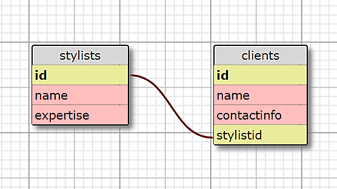

# Hair Salon

#### _A Hair Salon Web Application for Epicodus Java Week 3 Independent Project, July 14, 2017_

#### By _**Witty Chang**_

## Description

This is a program that allows a hair salon manager to execute various tasks relating to tracking stylists and clients to make their day to day life easier.

## Specifications

* It allows the user to see a list of all stylists.
* It allows the user to select a stylist, see their details and a list of all clients that belong to that stylist.
* It allows the user to add new stylists to the system when they are hired.
  * _Example Input: Stylist Name: Henry; Expertise: Brazilian Blowouts_
  * _Example Output: "Registration Confirmed. New stylist has been added."_
* It allows the user to add new clients to a specific stylist.
  * _Example Input: Client Name: Narcissistic Nate; Client Contact Info: (206) XXX XXXX_
  * _Example Output: Registration Confirmed. New client has been assigned to Stylist Henry_
* It allows the user to update a stylist's details.
* It allows the user to update a client's details.
* It allows the user to remove a stylist from the system if they are no longer employed by the company.
* It allows the user to delete a client if they no longer visit the salon.

## Database Schema



  ## What's Included

```
hair-salon
    ├── README.md
    ├── build.gradle
    ├── database.sql
    ├── schema.png
    ├── .gitignore
    └── src
         ├── main
         │     ├── java
         │     │     ├── App.java
         │     │     ├── Client.java
         │     │     ├── DB.java
         │     │     ├── Stylist.java
         │     │     └── VelocityTemplateEngine.java
         │     └── resources
         │             ├── public
         |             |      └── app.css
         │             └── templates
         │                    ├── client.vtl
         │                    ├── index.vtl
         │                    ├── layout.vtl
         │                    ├── stylist-clients-form.vtl
         │                    ├── stylist-clients-success.vtl
         │                    ├── stylist-delete-success.vtl
         │                    ├── stylist-form.vtl
         │                    ├── stylist-success.vtl
         │                    ├── stylist.vtl
         │                    └── stylists.vtl
         └── test
               └── java
                     ├── ClientTest.java
                     ├── DatabaseRule.java
                     └── StylistTest.java
```

## Setup/Installation Requirements

You will need [gradle](https://gradle.org/gradle-download/) and PostgreSQL installed on your device.

Enter the following commands in your terminal:
* `$ git clone https://github.com/wcchang1382/hair-salon-2.0`;
* In a new terminal window, `$ postgres` to start the PostgreSQL server;
* In another terminal window, `$ psql` to launch PSQL.

In PSQL:
* `CREATE DATABASE hair_salon;`

In your terminal:
* `$ psql hair_salon < database.sql;`
* `$ gradle run` to run the application;
* Navigate to http://localhost:4567 in a web browser of your choice.


## Support and contact details

Please feel free to contact wcc1213@gmail.com if you have any questions, issues, concerns, comments or suggestions.

## Technologies Used

* Java
* jUnit
* Gradle
* PostgreSQL
* Spark

### License

_Permission is hereby granted, free of charge, to any person obtaining a copy of this software and associated documentation files (the "Software"), to deal in the Software without restriction, including without limitation the rights to use, copy, modify, merge, publish, distribute, sublicense, and/or sell copies of the Software, and to permit persons to whom the Software is furnished to do so, subject to the following conditions:

The above copyright notice and this permission notice shall be included in all copies or substantial portions of the Software.

THE SOFTWARE IS PROVIDED "AS IS", WITHOUT WARRANTY OF ANY KIND, EXPRESS OR IMPLIED, INCLUDING BUT NOT LIMITED TO THE WARRANTIES OF MERCHANTABILITY, FITNESS FOR A PARTICULAR PURPOSE AND NONINFRINGEMENT. IN NO EVENT SHALL THE AUTHORS OR COPYRIGHT HOLDERS BE LIABLE FOR ANY CLAIM, DAMAGES OR OTHER LIABILITY, WHETHER IN AN ACTION OF CONTRACT, TORT OR OTHERWISE, ARISING FROM, OUT OF OR IN CONNECTION WITH THE SOFTWARE OR THE USE OR OTHER DEALINGS IN THE SOFTWARE._

Copyright (c) 2017 **_Witty Chang_**
